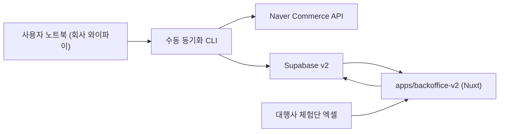

# Backoffice v2 Commerce Platform 설계안

- 작성일: 2026-03-20
- 기준 브랜치: `dev/naver-commerce-api`
- 기준 폴더: `apps/backoffice-v2`
- 목표: `main`과 현재 배포본을 건드리지 않고, 네이버 커머스 API 기반 주문 수집 구조를 가진 차기 버전(`v2`)을 별도 앱/별도 DB에서 완성한다. 단, 내부 구조는 `네이버 1차 구현 + 추후 쿠팡/카카오 확장`을 전제로 설계한다.

---

## 1. 이번 작업에서 확정된 결정

### 1-1. 운영 원칙

- `main`은 현재 배포 기준선으로 유지한다.
- 개발 브랜치는 `dev/naver-commerce-api`를 사용한다.
- 현재 앱은 `apps/backoffice-v2`로 별도 복제해 그 안에서만 구조 변경을 진행한다.
- `v2`는 별도 Supabase 프로젝트를 사용한다.
- `v2`는 먼저 로컬에서만 검증하고, 완성 후에만 Vercel 배포를 검토한다.

### 1-2. 데이터 수집 원칙

- 주문 데이터는 네이버 커머스 API로 수집한다.
- 체험단 데이터는 기존처럼 엑셀 업로드를 유지한다.
- 주문 동기화는 1차에서 `회사 와이파이에 연결된 노트북에서 수동 실행`한다.
- 회사 외부에서는 조회만 가능하고, API 동기화 실행은 기본적으로 하지 않는다.
- `Vercel 서버가 네이버 API를 직접 호출하는 구조`는 1차 설계에서 제외한다.

### 1-3. 구현 우선순위 원칙

- 1차 목표는 `현재 앱을 v2로 동일하게 띄우는 것`이다.
- 2차 목표는 `별도 Supabase에 main 스키마/RLS를 먼저 최대한 그대로 복제`하는 것이다.
- 3차 목표는 `주문 수집층과 상품 매핑 구조를 멀티 커머스 확장형으로 설계`하는 것이다.
- 4차 목표는 `네이버 커머스 API 주문 수집층`을 추가하는 것이다.
- 5차 목표는 `/upload`를 `주문 동기화 + 체험단 업로드` 구조로 재설계하는 것이다.

### 1-4. 채널 확장 원칙

- 1차 구현 채널은 `네이버 스마트스토어`다.
- 하지만 v2의 주문 수집/매핑/원본 저장 구조는 `쿠팡`, `카카오` 같은 추가 커머스 채널도 받을 수 있게 설계한다.
- 따라서 raw 저장소, sync run, mapping 테이블은 가능하면 `네이버 전용 이름/컬럼`보다 `채널 공통 구조`를 우선한다.
- 화면에서는 당장은 네이버 기준 UX로 시작하되, 내부 데이터 모델은 `source_channel`을 기본 축으로 둔다.
- 즉 현재 문서의 실행 범위는 `네이버 API`지만, 설계 범위는 `멀티 커머스 백오피스`다.

### 1-5. 문서 기준선과 정리 원칙

- `docs/`를 기준 문서 루트로 사용한다.
- `apps/backoffice-v2/docs/`는 `v2 앱 복제 과정에서 따라온 스냅샷`으로 취급한다.
- 따라서 구조/설계/DB/운영 기준을 바꾸는 문서는 우선 `docs/`에서 수정한다.
- `apps/backoffice-v2/docs/`는 앱 내부에서만 의미가 있는 로컬 메모가 아니면 새 기준 문서를 만들지 않는다.
- 문서 맵과 기준선은 [DOCUMENTATION_MAP.md](/Users/huicheol/Desktop/스마트스토어/smartstore_purchase/docs/DOCUMENTATION_MAP.md) 를 따른다.

---

## 2. 현재 기준선 정리

### 2-1. 현재 앱 구조

현재 main 앱은 `Nuxt 4 + Supabase + Vercel` 기반 SPA이며, 핵심 매출분석 흐름은 아래와 같다.

1. `/upload`에서 통합 엑셀(주문 + 체험단) 업로드
2. `useExcelParser.ts`에서 주문/체험단 파싱 및 정규화
3. `purchases`, `experiences`에 적재
4. `/filter`에서 체험단 매칭 실행
5. `/customers`, `/dashboard`, `/growth-stages`에서 분석

현재 주문 업로드에 실제로 요구하는 필수 컬럼은 코드 기준 아래다.

- `상품주문번호`
- `상품명`
- `상품번호`
- `옵션정보`
- `수량`
- `구매자명`
- `구매자ID`
- `수취인명`
- `주문일시`
- `주문상태`
- `클레임상태`

즉 현재 `purchases`는 이미 “엑셀 주문행 정규화 결과”를 중심으로 움직이고 있고, API 수집용 구조는 아직 없다.

### 2-2. live main DB 기준선

2026-03-20 기준 live main DB에서 public 테이블 존재와 RLS 활성 여부를 확인했다. 확인된 주요 테이블은 아래다.

| 테이블 | 확인 시점 row 수 | RLS |
|---|---:|---|
| `profiles` | 6 | 활성 |
| `products` | 38 | 활성 |
| `campaigns` | 6 | 활성 |
| `purchases` | 1,619 | 활성 |
| `experiences` | 835 | 활성 |
| `filter_logs` | 24 | 활성 |
| `override_logs` | 0 | 활성 |
| `notifications` | 62 | 활성 |
| `automation_jobs` | 63 | 활성 |
| `attendance_records` | 26 | 활성 |
| `attendance_settings` | 1 | 활성 |
| `leave_requests` | 4 | 활성 |
| `attendance_work_sessions` | 34 | 활성 |

설계의 DB 기준 문서는 아래 순서로 본다.

1. live main DB 실제 스키마/RLS
2. `docs/sql/*.sql`
3. `docs/DB_COLUMNS_REFERENCE.md`
4. `docs/DB_DESIGN_PHASE0_1.md`

문서 기준선은 아래 순서로 본다.

1. `docs/DOCUMENTATION_MAP.md`
2. `docs/BACKOFFICE_ENGINEERING_HANDOFF.md`
3. 이 문서 (`docs/naver-commerce-api/BACKOFFICE_V2_NAVER_COMMERCE_API_DESIGN.md`)
4. 주제별 세부 문서 (`docs/DB_COLUMNS_REFERENCE.md`, `docs/sql/backoffice_v2/*`, `Work_automation/*`, `Attendance management/*`)
5. `apps/backoffice-v2/docs/*` 복제본

### 2-3. 현재 주문 업로드 구조의 한계

현재 구조는 아래 이유로 네이버 커머스 API와 맞지 않는다.

- 브라우저에서 `client_secret`을 다루면 안 된다.
- 토큰 발급에 bcrypt 서명 생성이 필요하다.
- 호출 IP가 회사 IP로 고정되어야 한다.
- 주문 변경분 조회는 24시간 범위 제한이 있다.
- 단순 1회 요청이 아니라 `증분 동기화 + 상세 조회 + 재시도 + 커서 관리`가 필요하다.

즉 지금 필요한 변화의 핵심은 `필터링 엔진`보다 `주문 수집/적재 구조`다.

---

## 3. 왜 main 위 점진 수정이 아니라 v2 분리인가

이번 변경은 단일 기능 추가가 아니라 아래 4개 축이 동시에 바뀐다.

- 주문 수집 경계: 엑셀 -> API
- 실행 위치: 브라우저/Vercel -> 회사 네트워크의 로컬 실행
- 데이터 모델: 업로드 배치 중심 -> 증분 동기화 중심
- 운영 UX: 파일 업로드 -> 동기화 실행/이력 관리

이걸 `main` 위에서 바로 섞어 수정하면 아래 문제가 생긴다.

- 현재 배포본과 진행 중 구조가 섞인다.
- DB 변경이 main에 바로 영향을 준다.
- `/upload`, `purchases`, `products`의 의미가 중간 단계에서 흔들린다.
- API 기반 실험과 기존 엑셀 운영 이슈를 분리하기 어렵다.

따라서 이번 건은 `main 유지 + v2 별도 앱 + v2 별도 DB`가 맞다.

---

## 4. 네이버 커머스 API 제약사항과 설계 반영

### 4-1. 확인된 제약

- OAuth 2.0 Client Credentials 방식
- 토큰 발급 유효 시간 약 3시간
- 호출 IP는 앱에 등록된 허용 IP만 가능
- 샌드박스 없음
- 변경 주문 조회는 24시간 범위 제한
- 변경 주문 조회는 최대 300건 단위이며 `moreFrom`, `moreSequence` 기반 후속 요청 필요
- 상세 조회는 `productOrderId` 최대 300개 단위
- 닉네임, 리뷰 URL은 커머스 API만으로 확보 불가

### 4-2. 이 제약이 의미하는 설계 결론

- 주문 동기화는 `회사 와이파이의 로컬 실행`이 기준이어야 한다.
- 배포된 Vercel 앱은 조회용 UI로는 괜찮지만, 동기화 실행 주체로는 1차 구조에 맞지 않는다.
- 수집은 반드시 `변경 목록 조회 -> 상세 조회 -> 정규화 -> 적재` 2단계여야 한다.
- 며칠 동안 출근하지 않아도 누락되지 않게, `마지막 성공 지점부터 하루씩 메꾸는 백필 루프`가 필요하다.
- 체험단 데이터는 계속 엑셀을 유지해야 한다.

---

## 5. 목표 아키텍처



### 5-1. 핵심 원칙

- 네이버 API 호출은 `회사 와이파이의 노트북`에서만 발생한다.
- 결과는 별도 Supabase v2에 저장한다.
- `apps/backoffice-v2`는 어디서든 Supabase v2를 읽어 화면을 제공한다.
- 체험단은 기존 엑셀 업로드 흐름을 유지한다.
- 주문과 체험단의 “수집 방식”은 달라도, 필터링과 분석은 같은 DB 안에서 만난다.
- 이후 쿠팡, 카카오를 붙일 때도 `채널별 수집기 -> 공통 raw -> 공통 projection(purchases)` 구조를 유지한다.

### 5-3. 멀티 커머스 목표 범위

- `Naver`: 1차 구현 채널. 가장 먼저 실제 동기화 CLI와 운영 흐름을 만든다.
- `Coupang`: 2차 후보 채널. 네이버 구현 후 동일한 `source_channel` 구조에 별도 커넥터를 추가한다.
- `Kakao`: 3차 후보 채널. 채널별 상품/주문 식별자 차이를 `commerce_*` raw + mapping 계층에서 흡수한다.
- 공통 원칙은 동일하다.
  - 채널별 인증/수집 로직은 분리
  - raw 저장 형식은 공통화
  - `purchases`는 분석용 공통 projection 유지
  - 상품 매핑은 `commerce_product_mappings` 중심

### 5-2. 1차에서 의도적으로 하지 않는 것

- Vercel 서버에서 네이버 API 직접 호출
- 회사 외부 자동 실시간 동기화
- 체험단 API화
- 리뷰 URL 수집 자동화
- 상품 API 전체 동기화 우선 구현

---

## 6. `apps/backoffice-v2` 폴더 운영 원칙

현재 `apps/backoffice-v2`는 현 저장소를 기준으로 소스/설정 중심 복제본으로 생성했다.

복제 목적은 아래다.

- 기존과 거의 동일한 앱을 별도로 띄운다.
- `v2` 안에서 구조를 크게 바꿔도 `main`은 영향받지 않게 한다.
- 최종적으로는 “부분 병합”보다 “v2를 차기 버전으로 채택”하는 판단이 가능하게 만든다.

### 6-1. 복제본에 포함된 범위

- `app/`
- `public/`
- `server/`
- `crawler/`
- `tests/`
- `docs/`
- `Work_automation/`
- `Attendance management/`
- 루트 설정 파일(`package.json`, `nuxt.config.ts`, `tsconfig.json`, `vercel.json`, 테스트 설정 등)

### 6-2. 복제 시 제외한 범위

- `.git`
- `node_modules`
- `crawler/node_modules`
- `.nuxt`
- `.vercel`
- `dist`
- `playwright-report`
- `test-results`
- 로컬 엑셀 파일
- `.rtf` 문서

### 6-3. 즉시 주의사항

`apps/backoffice-v2/.env`는 복제 과정에서 함께 생겼으므로, `v2`를 실행하기 전에 반드시 `별도 Supabase v2 값`으로 교체해야 한다. 이 교체 전에는 `v2`를 실행하지 않는 것이 안전하다.

---

## 7. v2 Supabase 부트스트랩 설계

### 7-1. 왜 “main 스키마 복제 먼저”가 맞는가

`v2`는 먼저 “지금 앱이 그대로 뜨는 상태”를 재현해야 한다. 그래야 이후 이슈를 아래 둘로 분리할 수 있다.

- 기본 앱 복제 문제
- 커머스 API 전환 문제

처음부터 스키마를 새로 짜면 두 문제가 섞인다.

### 7-2. 부트스트랩 순서

1. live main DB의 현재 스키마/RLS를 기준선으로 잡는다.
2. `docs/sql/*.sql` 패치와 실제 live 상태의 차이를 확인한다.
3. 별도 Supabase v2에 main의 현재 스키마/RLS를 먼저 재현한다.
4. `apps/backoffice-v2`가 기존과 동일하게 로그인/조회/업로드 되는지 확인한다.
5. 그 다음에만 커머스 API용 신규 테이블/컬럼을 추가한다.

### 7-3. 기존 패치 파일 적용 우선 확인 목록

아래 패치들은 최소한 검토 후 v2에 반영해야 한다.

- `docs/sql/2026-02-23_phase1_modifier_and_actor_log_patch.sql`
- `docs/sql/2026-02-23_products_delete_rls_hotfix.sql`
- `docs/sql/2026-02-23_products_option_name_patch.sql`
- `docs/sql/2026-02-24_experiences_unique_empty_naver_patch.sql`
- `docs/sql/2026-03-03_month_count_rpc.sql`
- `docs/sql/2026-03-03_notifications_phase15.sql`
- `docs/sql/2026-03-05_attendance_phase1.sql`
- `docs/sql/2026-03-05_auth_confirm_on_approval.sql`
- `docs/sql/2026-03-05_profiles_signup_approval_patch.sql`
- `docs/sql/2026-03-09_profiles_auto_approve_modifier_patch.sql`
- `docs/sql/2026-03-09_purchases_source_fields_patch.sql`
- `docs/sql/2026-03-10_attendance_onoff_early_leave_patch.sql`
- `docs/sql/2026-03-10_attendance_phase2.sql`
- `docs/sql/2026-03-10_attendance_work_sessions_patch.sql`
- `docs/sql/2026-03-19_products_expected_consumption_days.sql`

### 7-4. v2 부트스트랩 완료 기준

아래가 모두 되면 “v2 기본 복제” 완료로 본다.

- 로그인 가능
- `/dashboard`, `/upload`, `/filter`, `/customers`, `/products` 진입 가능
- 근태/업무자동화 라우트도 기존과 동일하게 열림
- RLS로 역할별 접근이 현재와 동일하게 동작
- `main` DB가 아니라 `v2` DB를 읽고 있음이 확인됨

---

## 8. 주문 동기화 방식 설계

### 8-1. 1차 실행 방식

1차 구현은 `터미널 스크립트 수동 실행`을 기준으로 한다.

이 방식이 가장 안전한 이유는 아래다.

- 회사 IP 제약을 그대로 만족시킬 수 있다.
- 토큰/시크릿을 브라우저에 노출하지 않는다.
- 실패 로그와 재시도를 먼저 안정화하기 쉽다.
- Vercel egress IP 문제를 우회할 수 있다.

단, 이 방식은 어디까지나 `1차 안전한 운영안`이다.
문서상으로도 최종 운영 구조라고 보면 안 된다.

- 담당자 부재 시 동기화가 멈출 수 있다.
- 회사 와이파이와 특정 노트북에 종속된다.
- 사람의 실행 습관이 시스템 품질을 좌우하는 단일 장애점이 된다.

즉 현재 수동 실행은 “지금 당장 가장 안전하게 시작하는 방법”이지, 장기 운영 목표는 아니다.

### 8-2. 동기화 기본 흐름

1. 회사 와이파이에 연결된 상태에서 동기화 스크립트 실행
2. 토큰 발급
3. 마지막 성공 지점 이후를 24시간 창으로 분할
4. 각 창마다 `변경 상품 주문 내역 조회`
5. 응답에서 `productOrderId` 수집
6. `상품 주문 상세 내역 조회`로 상세 데이터 취득
7. raw 테이블 저장
8. `purchases` 호환 형태로 정규화/UPSERT
9. 성공한 창까지만 cursor 전진

### 8-3. 며칠 비운 경우 동작 방식

예를 들어 화요일 이후 동기화를 못 했고 금요일에 회사에 왔다면, 스크립트는 아래처럼 동작해야 한다.

1. 마지막 성공 시각 확인
2. 그 다음 구간부터 24시간씩 루프
3. 실패한 창이 나오면 그 뒤는 멈춤
4. 재실행 시 실패 창부터 다시 시작

즉 “주 2회 수동 동기화”여도 중간 날짜가 빠지지 않아야 한다.

### 8-4. 초기 백필 범위

초기 백필 기준은 사용자 결정대로 `기존 운영 월 전체`다.

실행 원칙은 아래다.

1. `main`에서 실제 운영 중인 가장 이른 주문 월을 기준 시작점으로 잡는다.
2. 그 시작점부터 현재 시점까지를 24시간 창으로 나눠 `backfill` run을 수행한다.
3. 전체 백필이 끝난 뒤에만 `incremental` 모드로 넘어간다.
4. 백필과 증분 동기화 모두 같은 raw/projection 저장 로직을 사용한다.

즉 1회성 과거 이관과 이후 증분 수집이 서로 다른 코드가 되면 안 된다.

### 8-5. 운영 리스크와 다음 목표

현재 구조의 운영 리스크는 아래와 같다.

- `회사 와이파이 + 수동 실행`에 묶여 있다.
- 담당자가 장기간 자리를 비우면 동기화가 멈춘다.
- 사무실 네트워크 이슈가 있으면 주문 적재가 지연된다.

따라서 다음 단계 운영 목표는 아래 순서를 따른다.

1. 현재 수동 동기화 구조를 안정화한다.
2. 회사 네트워크 안의 `고정 IP 장비 또는 고정 실행 환경`을 정한다.
3. 그 장비에서 정기 동기화를 자동 실행한다.
4. 최종적으로는 “사람이 누르는 구조”를 제거한다.

즉 수동 실행은 시작점이고, 자동화된 고정 실행 환경이 목표다.

---

## 9. v2 DB 변경 설계

## 9-1. 유지하는 기존 핵심 테이블

- `profiles`
- `products`
- `campaigns`
- `purchases`
- `experiences`
- `filter_logs`
- `override_logs`

이 7개는 계속 매출분석 핵심 테이블로 유지한다.

## 9-2. 신규 추가 테이블

### A. `commerce_sync_runs`

수동 동기화 1회 실행 단위 로그.

권장 컬럼:

- `id uuid pk`
- `source_channel text`
- `source_account_key text null`
- `run_type text` (`manual_sync`, `backfill`)
- `requested_by_account_id uuid null`
- `requested_from timestamptz`
- `requested_to timestamptz`
- `status text` (`pending`, `running`, `done`, `partial`, `failed`)
- `started_at timestamptz`
- `completed_at timestamptz null`
- `summary_json jsonb`
- `error_message text null`

### B. `commerce_sync_windows`

1회 실행 안의 24시간 창 단위 처리 로그.

권장 컬럼:

- `id bigserial pk`
- `run_id uuid fk`
- `window_from timestamptz`
- `window_to timestamptz`
- `status text`
- `changed_count integer`
- `detail_count integer`
- `upserted_count integer`
- `excluded_count integer`
- `pagination_json jsonb`
- `error_message text null`
- `created_at timestamptz`

### C. `commerce_sync_cursors`

마지막 성공 지점 보관.

권장 컬럼:

- `source_channel text`
- `source_account_key text null`
- `last_success_from timestamptz`
- `last_success_to timestamptz`
- `last_success_changed_at timestamptz`
- `last_run_id uuid null`
- `updated_at timestamptz`

기본 키:

- `source_channel + source_account_key`

### D. `commerce_order_events_raw`

채널별 주문 변경 이벤트 원본 저장.

권장 컬럼:

- `id bigserial pk`
- `source_channel text`
- `source_account_key text null`
- `run_id uuid fk`
- `window_id bigint fk`
- `source_order_id text`
- `source_line_id text`
- `event_type text`
- `event_at timestamptz`
- `order_status text null`
- `payment_date timestamptz null`
- `extra_flags jsonb null`
- `raw_json jsonb`
- `created_at timestamptz`

고유성 기준:

- `source_channel + source_line_id + event_at + event_type`

비고:

- 네이버 1차 구현에서는 changed-status 응답을 이 테이블에 적재한다.
- 이후 쿠팡/카카오도 “주문행 단위 변경 이벤트” 개념으로 여기에 맞춘다.

### E. `commerce_order_lines_raw`

채널별 주문행 상세 최신 스냅샷 저장.

권장 컬럼:

- `source_channel text`
- `source_account_key text null`
- `source_line_id text`
- `source_order_id text`
- `source_product_id text`
- `source_option_code text null`
- `product_name text`
- `product_option text null`
- `buyer_id text null`
- `buyer_name text null`
- `receiver_name text null`
- `receiver_phone_masked text null`
- `receiver_base_address text null`
- `receiver_detail_address text null`
- `quantity integer`
- `product_order_status text`
- `claim_status text null`
- `order_date timestamptz null`
- `payment_date timestamptz null`
- `decision_date timestamptz null`
- `invoice_number text null`
- `last_event_type text null`
- `last_event_at timestamptz null`
- `raw_json jsonb`
- `synced_at timestamptz`

기본 키:

- `source_channel + source_line_id`

### F. `commerce_product_mappings`

외부 커머스 상품 식별자와 내부 상품 마스터 연결 테이블.

권장 컬럼:

- `id bigserial pk`
- `source_channel text`
- `source_account_key text null`
- `commerce_product_id text`
- `commerce_option_code text null`
- `commerce_product_name text`
- `commerce_option_name text null`
- `internal_product_id text`
- `matching_mode text` (`product_id_only`, `product_id_option`, `name_option_rule`, `manual`)
- `canonical_variant text null`
- `rule_json jsonb null`
- `mapping_source text` (`manual`, `fallback_name_option`, `product_sync`)
- `priority integer default 100`
- `is_active boolean`
- `created_at timestamptz`
- `updated_at timestamptz`
- `last_seen_at timestamptz`

고유성 기준:

- `source_channel + commerce_product_id + commerce_option_code + canonical_variant`

## 9-3. 기존 `purchases`에 추가해야 하는 컬럼

`purchases`는 계속 “분석용 투영 테이블”로 유지하되, 아래 컬럼은 사실상 다음 단계에서 반드시 추가해야 한다.

### A. API 출처 추적 컬럼

- `source_channel text default 'excel'`
- `source_account_key text null`
- `source_order_id text null`
- `source_product_id text null`
- `source_option_code text null`
- `source_last_changed_at timestamptz null`
- `source_sync_run_id uuid null`

### B. 금액/정산 분석 컬럼

- `payment_amount numeric null`
- `expected_settlement_amount numeric null`
- `payment_commission numeric null`
- `sale_commission numeric null`

### C. 유입/디바이스 분석 컬럼

- `inflow_path text null`
- `inflow_path_add text null`
- `pay_location_type text null`

중요한 설계 원칙은 아래다.

- `purchase_id`는 계속 주문행 단위 식별자로 유지한다.
- API 주문에서는 `purchase_id = productOrderId`를 사용한다.
- `orderId`는 별도 `source_order_id`에 저장한다.
- 현재 코드 호환성을 위해 `product_id`는 당장은 기존처럼 유지하되, source 식별자와 금액/유입 값은 새 컬럼에 분리한다.

여기서 중요한 점은 아래다.

- `결제금액`과 `객단가`는 nice-to-have가 아니다.
- 굿포펫 백오피스가 실구매 분석 도구라면, 금액 부재는 핵심 공백이다.
- 따라서 금액 관련 컬럼은 단순 “추후 검토”가 아니라 `P0~P1 우선순위`로 올려야 한다.

## 9-4. `purchases`를 raw 저장소로 바꾸지 않는 이유

`purchases`는 현재 필터링/고객분석/대시보드가 직접 읽는 핵심 테이블이다. 이 테이블을 raw API 원본 저장소로 바꾸면 화면 전반이 흔들린다.

따라서 역할을 분리한다.

- raw 원본: `commerce_*_raw`
- 분석 투영: `purchases`

즉 `purchases`는 계속 “분석 가능한 주문행만 모아둔 projection”이어야 한다.

동시에 아래 원칙도 함께 둔다.

- `raw_json`은 안전장치이지, 주 전략이 아니다.
- 금액/유입경로처럼 비즈니스 가치가 명확한 값은 지금 스키마 컬럼으로 승격해야 한다.
- `나중에 raw_json에서 backfill`은 보조 수단으로만 사용한다.

즉 raw 보존은 중요하지만, 명확한 핵심 값까지 계속 raw에만 두는 것은 기술 부채가 된다.

## 9-5. 신규 테이블 보안/RLS 원칙

신규 테이블은 기존 public 운영 규칙과 충돌하지 않게 아래 원칙으로 가는 것이 안전하다.

- `commerce_sync_runs`: `admin`, `modifier` 읽기 가능
- `commerce_sync_windows`: `admin`, `modifier` 읽기 가능
- `commerce_product_mappings`: `admin`, `modifier` 읽기/수정 가능
- `commerce_order_events_raw`: 일반 화면 직접 조회 금지, `admin`, `modifier`만 읽기
- `commerce_order_lines_raw`: 일반 화면 직접 조회 금지, `admin`, `modifier`만 읽기
- 쓰기는 기본적으로 `service-role` 경로에서만 수행

즉 원칙은 아래와 같다.

- 화면이 직접 쓰는 운영 테이블은 제한적으로 유지
- 동기화 원본/로그는 서비스 경로 중심
- `viewer`는 기존처럼 분석 결과만 보게 하고 raw 수집 테이블은 숨긴다

---

## 10. API -> `purchases` 매핑 규칙

### 10-1. 네이버 1차 기본 매핑

| `purchases` 컬럼 | API 원천 |
|---|---|
| `purchase_id` | `productOrder.productOrderId` |
| `buyer_id` | `order.ordererId` |
| `buyer_name` | `order.ordererName` |
| `receiver_name` | `productOrder.shippingAddress.name` |
| `customer_key` | `${buyer_id}_${buyer_name}` |
| `product_name` | `productOrder.productName` 정규화값 |
| `option_info` | `productOrder.productOption` 정규화값 |
| `source_product_name` | `productOrder.productName` 원문 |
| `source_option_info` | `productOrder.productOption` 원문 |
| `quantity` | `productOrder.quantity` |
| `order_date` | `COALESCE(order.paymentDate, order.orderDate)::date` |
| `order_status` | `productOrder.productOrderStatus` |
| `claim_status` | `productOrder.claimStatus` |
| `source_order_id` | `order.orderId` |
| `source_product_id` | `productOrder.productId` |
| `source_option_code` | `productOrder.optionCode` |
| `source_last_changed_at` | changed-status 응답의 `lastChangedDate` |

### 10-2. 상품 매핑 규칙

핵심 원칙은 `상품번호 우선, 상품별 예외 규칙 허용`이다.

상세 구현 기준과 초기 상품번호 시드 정책은 [COMMERCE_PRODUCT_MAPPING_STRATEGY.md](/Users/huicheol/Desktop/스마트스토어/smartstore_purchase/docs/naver-commerce-api/COMMERCE_PRODUCT_MAPPING_STRATEGY.md) 를 따른다.

1. `commerce_product_mappings`에서 `source_channel + commerce_product_id`로 먼저 상품군을 찾는다.
2. 해당 상품이 옵션 구분형이면 `commerce_option_code` 또는 정규화한 `option_info`까지 같이 본다.
3. 해당 상품이 이름/옵션 예외형이면 `rule_json`에 정의된 키워드 규칙으로 최종 variant를 결정한다.
4. 그래도 단일 후보가 안 나오면 현재 앱의 `상품명 + 옵션명` 정규화 매칭을 fallback으로 시도한다.
5. fallback으로 단일 후보가 나오면 자동 매핑 생성 가능하다.
6. 그래도 못 찾으면 `매핑 필요` 상태로 남기고 운영자가 연결한다.

### 10-3. 현재 확인된 상품군별 매핑 방향

- 일반 상품:
  `상품번호`만으로 내부 상품이 안정적으로 특정되면 `matching_mode = product_id_only`
- 츄라잇:
  `상품번호`로 상품군을 먼저 잡고, 실제 세부 구분은 `옵션명`으로 한다. 즉 `matching_mode = product_id_option`
- 애착트릿 리뉴얼:
  `상품번호`만으로 맛이 100% 고정되지 않는다. 따라서 `상품번호`로 리뉴얼 애착트릿 군을 먼저 잡고, `상품명 + 옵션명`에서 `치킨/연어/북어` 키워드를 읽어 최종 variant를 결정한다. 즉 `matching_mode = name_option_rule`
- 애착트릿 리뉴얼 전 동결건조:
  리뉴얼 후 애착트릿과 다른 상품군으로 분리 유지한다.

즉 `상품번호를 상품목록에 연결해두는 전략`은 맞지만, 실제 저장 구조는 `products` 단일 컬럼보다 `commerce_product_mappings`가 더 안전하다.

### 10-4. 운영 UI 원칙

- 운영자는 `/products` 화면에서 내부 상품과 외부 상품번호를 연결한다.
- 네이버 1차에서는 `네이버 상품번호`를 관리하지만, 같은 UI 구조로 쿠팡/카카오 상품번호도 붙일 수 있게 한다.
- 화면상으로는 “상품명 옆에 외부 상품번호를 등록”하는 UX가 자연스럽고, DB에서는 이를 `commerce_product_mappings`로 관리한다.

### 10-5. 주문 유효성 판정 규칙

1차는 “분석용 구매행” 기준으로 아래 상태만 `purchases`에 유지하는 방향이 안전하다.

- `PAYED`
- `DISPATCHED`
- `DELIVERING`
- `DELIVERED`
- `PURCHASE_DECIDED`

아래와 같은 상태는 `purchases`에서 제외하고 raw에는 남긴다.

- `CANCELED`
- `RETURNED`
- `CANCELED_BY_NOPAYMENT`
- 취소/반품/직권취소 계열 `claimStatus`

즉 설계 원칙은 아래다.

- raw는 보존
- projection(`purchases`)은 분석 대상만 유지

이 방식은 현재 엑셀 업로드 구조가 “유효 주문만 남긴다”는 운영 감각과도 맞다.

### 10-6. 이름 마스킹 리스크와 현재 판단

현재 프로젝트의 체험단 필터링은 `이름 + buyer_id + 상품 + 옵션 + 날짜`를 조합해 5단계 Rank로 판단한다.
따라서 이름 필드가 마스킹되면, 필터 품질은 직접 영향을 받을 수 있다.

여기서 현재 판단은 아래와 같다.

- 이름은 중요한 신호이지만 유일한 신호는 아니다.
- `buyer_id`는 현재 구조에서 더 안정적인 1차 식별자다.
- 이름은 API에서 `황*호`, `김*소`처럼 마스킹되어 들어올 수 있다.
- 따라서 Rank 로직은 `이름 exact match`만 전제하면 안 된다.
- 현재 구조는 `buyer_id + 이름 패턴 매칭 + 상품/옵션/날짜`의 조합으로 보완해야 한다.

다만 대표 관점에서 중요한 건 “정량화”이고, 이 문서는 그 부분을 다음 검증 항목으로 올린다.

반드시 수치화해야 하는 항목:

1. 월별 이름 마스킹 발생 비율
2. `buyer_id` exact match 비율
3. 이름 마스킹 보정 규칙 적용 전/후 매칭률 변화
4. `확인 필요(needs_review)` 증가/감소 폭
5. 수동 보정 비율

즉 현재 결론은 아래다.

- 이름 마스킹 리스크는 실제로 존재한다.
- 시스템 전체가 즉시 무너진다고 단정하진 않지만, 정확도 검증 없이 신뢰할 수 있다고 말할 단계도 아니다.
- 따라서 이 리스크는 문서상 `즉시 정량화 필요 항목`으로 다뤄야 한다.

### 10-7. 결제 금액/객단가 부재는 핵심 공백

현재 주문 동기화는 주문 건수와 고객 수는 세지만, 금액은 아직 `purchases`에 별도 저장하지 않는다.

이 상태의 문제는 아래다.

- 실구매 건수는 보여도 매출 판단이 안 된다.
- 객단가를 계산할 수 없다.
- 상품별 “잘 팔리는 상품”은 보여도 “돈이 되는 상품”은 모른다.
- 광고/프로모션 이후 순매출 증가 판단이 불완전하다.

따라서 이 문서는 금액 필드를 단순 확장 항목이 아니라 `핵심 설계 공백`으로 본다.

---

## 11. 화면/코드 영향도

## 11-1. 크게 바뀌는 파일

### `app/pages/upload.vue`

현재:

- 통합 엑셀 1개 업로드
- 주문/체험단 동시 적재
- 업로드 결과/매핑 필요 표시

v2:

- 상단을 `주문 동기화` 영역으로 교체
- 하단은 `체험단 엑셀 업로드` 유지
- 마지막 동기화 시각, 동기화 범위, 마지막 성공 창, 실패 창, 매핑 필요 건수 표시
- 1차는 UI 버튼보다 상태판 중심, 실제 실행은 CLI

### `app/composables/useExcelParser.ts`

현재:

- 주문/체험단 엑셀 모두 담당

v2:

- 체험단 엑셀 전용 역할로 축소
- 주문 API 정규화는 별도 모듈로 분리

### `app/composables/useMonthlyWorkflow.ts`

현재:

- localStorage 기반 업로드/필터 상태 저장

v2:

- 주문 쪽은 `DB 기반 동기화 상태`를 읽도록 변경
- 체험단 업로드 상태만 로컬이 아니라 DB와 함께 정리하는 방향이 맞음

### `app/pages/products.vue`

v2에서는 상품 관리 화면에 아래 성격이 추가되어야 한다.

- 내부 상품별 외부 상품번호 등록/조회
- 채널 구분(`naver`, 추후 `coupang`, `kakao`)
- 옵션 구분형 상품 규칙 등록
- 예외 규칙형 상품(예: 애착트릿) 확인 및 수정

## 11-2. 비교적 유지 가능한 파일

- `app/composables/useFilterMatching.ts`
- `app/composables/usePurchaseQuantity.ts`
- `app/composables/useGrowthStage.ts`
- `app/composables/useChurnRisk.ts`
- `app/pages/filter.vue`
- `app/pages/customers.vue`
- `app/pages/dashboard.vue`

전제는 하나다.

`purchases`의 shape를 현재 기대치와 크게 다르지 않게 유지하는 것.

## 11-3. 추가될 가능성이 높은 v2 파일

권장 파일 구조:

```text
apps/backoffice-v2/
  scripts/
    naver-commerce/
      sync-orders.ts
      backfill-orders.ts
      verify-sync.ts
  server/
    utils/
      commerce/
        auth.ts
        client.ts
        channel.ts
        order-eligibility.ts
        order-normalizer.ts
        order-upsert.ts
        mapping.ts
        mapping-rules.ts
```

파일 역할:

- `auth.ts`: bcrypt 서명 + 토큰 발급
- `client.ts`: 채널별 커머스 API 공통 호출
- `channel.ts`: `naver`, 추후 `coupang`, `kakao` 채널 분기 정의
- `order-eligibility.ts`: 분석 대상 주문 여부 판정
- `order-normalizer.ts`: API 상세 -> `purchases` 호환 구조 변환
- `order-upsert.ts`: raw / projection 저장
- `mapping.ts`: `commerce_product_mappings` 처리
- `mapping-rules.ts`: 츄라잇/애착트릿 같은 상품별 예외 규칙 처리

---

## 12. 구현 우선순위

## 즉시 확인/결정 필요 (P0)

아래 항목은 이번 분기 안에 우선 답을 내야 하는 의사결정이다.

### P0-1. 금액 필드 저장

대상:

- `totalPaymentAmount`
- `expectedSettlementAmount`
- `paymentCommission`
- `saleCommission`

이유:

- 결제금액/객단가/정산 추정이 모두 이 값에 달려 있다.
- 실구매 분석 도구로서의 완성도에 직접 영향을 준다.

### P0-2. 이름 마스킹 리스크 정량화

대상:

- 월별 마스킹 비율
- 마스킹 보정 규칙 적용 전/후 비교
- 수동 보정 개입률

이유:

- 체험단 필터링 신뢰도 판단의 핵심이다.

### P0-3. 브랜드스토어 여부 확인

확인 항목:

- 굿포펫이 브랜드스토어인지
- API데이터솔루션(통계) 구독이 가능한지

이유:

- 마케팅 분석 API / 고객 데이터 API / 재구매 통계 API 검토의 선행조건이다.
- 기술 문제가 아니라 비즈니스 전제 확인이다.

### P0-4. 수동 동기화의 자동화 목표 확정

결정 항목:

- 사무실 고정 IP 장비를 둘지
- 사무실 PC 스케줄러로 운영할지
- 이후 서버/배치 전환할지

이유:

- 현재 구조는 임시 운영안이며, 장기 운영 구조를 빨리 정해야 한다.

## Phase 0. 분리 기반 고정

- `dev/naver-commerce-api` 브랜치 유지
- `apps/backoffice-v2`에서만 작업
- `main` 무수정 원칙 유지

## Phase 1. v2 복제본 정상 부팅

- `apps/backoffice-v2/.env`를 v2 Supabase로 교체
- v2 DB에 main 스키마/RLS 복제
- v2 로컬 실행
- 기존 화면이 현재처럼 뜨는지 확인

완료 기준:

- 로그인/기본 라우트/권한 동작 확인

## Phase 2. DB 확장

- `commerce_sync_runs`
- `commerce_sync_windows`
- `commerce_sync_cursors`
- `commerce_order_events_raw`
- `commerce_order_lines_raw`
- `commerce_product_mappings`
- `purchases` 추가 컬럼

특히 아래는 이 Phase에서 우선 처리한다.

- 금액 필드 저장
- 유입 경로 필드 저장
- 디바이스 구분 필드 저장

완료 기준:

- 마이그레이션 적용 후 기존 화면에 영향 없음
- `source_channel` 기준으로 네이버 외 채널 추가가 가능함

## Phase 3. 상품 매핑 정책 선구현

- `상품번호 우선` 매핑 구조 반영
- `/products` 기준 외부 상품번호 관리 구조 설계
- 일반 상품 / 츄라잇 / 애착트릿 규칙 분리
- 애착트릿 리뉴얼 전/후 상품군 분리 기준 확정

완료 기준:

- 현재 운영 상품들이 `product_id_only`, `product_id_option`, `name_option_rule` 중 하나로 분류됨
- 애착트릿 예외 규칙이 문서와 코드 양쪽에서 재현 가능함

## Phase 4. 네이버 주문 동기화 CLI

- 토큰 발급
- 24시간 창 분할
- changed-status 수집
- 상세 조회
- raw 저장
- `purchases` UPSERT/정리
- 실패 창 재시도

완료 기준:

- 회사 와이파이에서 수동 1회 실행 가능
- 같은 구간 재실행 시 중복 적재 없이 idempotent
- 금액/유입경로가 함께 저장됨

## Phase 5. 상품 매핑과 운영 보정

- `commerce_product_mappings` 기반 자동/수동 연결
- 매핑 필요 주문 표시
- `/products` 또는 `/upload`에서 연결 UX 정리

완료 기준:

- 신규 상품이 들어와도 운영자가 연결 가능

## Phase 6. `/upload` 재설계

- 주문 동기화 상태판
- 체험단 엑셀 업로드 유지
- 매핑 필요 목록 통합
- 월별 진행 상태 재정의

완료 기준:

- 운영자가 “이번 달 주문 동기화 + 체험단 업로드 + 필터링”을 한 화면 흐름에서 이해 가능

## Phase 7. 전체 백필과 검증

- 기존 운영 월 전체 백필
- 월별 집계 비교
- 실구매/체험단 판정 비교
- 수량 계산 비교
- 이름 마스킹 리스크 정량화
- 금액/객단가 검증

완료 기준:

- `main` 대비 수치 차이를 설명 가능
- 남은 차이가 의도적 변경인지, 버그인지 구분 가능
- 필터링 신뢰도와 매출 집계 신뢰도를 수치로 설명 가능

## Phase 8. 멀티 커머스 확장 준비

- Naver 전용 구현에서 공통 모듈과 채널별 모듈 경계 정리
- 쿠팡 주문 데이터 구조 매핑 초안 작성
- 카카오 주문 데이터 구조 매핑 초안 작성
- `source_channel` 기준 검증 리포트 구조 정리

완료 기준:

- 네이버 로직을 크게 뜯지 않고 `coupang`, `kakao` 커넥터를 추가할 수 있는 구조가 됨

---

## 13. 검증 기준

## 13-1. 기술 검증

- 동일 구간 재동기화 시 중복 없음
- 실패 후 재실행 시 cursor가 안전하게 이어짐
- 취소/반품 주문이 projection에서 빠짐
- 상품 매핑 실패가 있어도 전체 동기화는 멈추지 않음
- 체험단 엑셀 업로드는 기존처럼 동작

## 13-2. 업무 검증

운영 월별로 아래 수치를 main과 비교한다.

- 총 주문 행 수
- 제외 주문 수
- 체험단 행 수
- 매칭 건수
- 실구매 건수
- 확인 필요 건수
- 인기상품 상위 수량
- 고객 수

## 13-3. 컷오버 기준

아래가 충족될 때만 `v2`를 실제 사용 후보로 본다.

- 주문 동기화가 회사 와이파이에서 안정적으로 수행됨
- 체험단 업로드와 필터링이 기존 수준으로 동작
- 월별 핵심 지표 차이를 설명 가능
- 운영자 입장에서 기존보다 작업 난이도가 올라가지 않음

---

## 14. 롤백 전략

이번 구조는 롤백이 비교적 단순하다.

- `main`은 계속 기존 배포 상태 유지
- `v2`는 별도 브랜치, 별도 폴더, 별도 DB
- 문제가 생기면 `v2`를 중단하고 기존 `main` 흐름으로 바로 복귀 가능

즉 이번 설계의 장점은 “전환 실패가 곧 운영 장애가 되지 않는다”는 점이다.

---

## 15. 향후 확장 옵션

1차 설계에는 넣지 않지만, 이후 고려 가능한 선택지는 아래다.

- 회사 외부에서도 동기화하고 싶으면 `허용 IP 추가`
- 사무실 VPN으로 회사 IP를 타는 구조
- 고정 IP 서버를 따로 두고 네이버 앱 허용 IP로 등록
- 블로그 워커처럼 `pending job -> 사내 실행 주체가 처리` 모델로 확장
- `source_channel = coupang` 커넥터 추가
- `source_channel = kakao` 커넥터 추가
- 채널별 원본 payload 차이를 공통 projection으로 흡수
- 채널별 주문 상태/취소/클레임 정의 차이를 `order-eligibility` 계층에서 흡수
- 채널별 상품 식별자 차이를 `commerce_product_mappings`와 `matching_mode` 규칙으로 흡수

단, 현재 조건에서는 위 확장보다 `회사 와이파이 수동 동기화`가 가장 현실적이다.

---

## 16. 공식 문서 기준 링크

- 커머스 API 현재 문서 홈: <https://apicenter.commerce.naver.com/docs/commerce-api/current>
- OAuth 2.0: <https://apicenter.commerce.naver.com/docs/commerce-api/current/o-auth-2-0>
- 인증 토큰 발급 요청: <https://apicenter.commerce.naver.com/docs/commerce-api/current/exchange-sellers-auth>
- 변경 상품 주문 내역 조회: <https://apicenter.commerce.naver.com/docs/commerce-api/current/seller-get-last-changed-status-pay-order-seller>
- 상품 주문 상세 내역 조회: <https://apicenter.commerce.naver.com/docs/commerce-api/current/seller-get-product-orders-pay-order-seller>
- 상품 목록 조회: <https://apicenter.commerce.naver.com/docs/commerce-api/current/search-product>

---

## 17. 현재 설계의 결론

이번 건의 본질은 “기존 화면 위에 API 몇 개 붙이기”가 아니다.

정확한 표현은 아래다.

- `main`을 지키면서
- `v2`를 별도로 세우고
- `주문 수집 구조`를 API 기준으로 바꾸고
- `체험단 엑셀`은 유지하면서
- 최종적으로 `필터링/분석 레이어는 최대한 재사용`하는 프로젝트다.
- 그리고 그 내부 구조는 `네이버 1차, 쿠팡·카카오 확장 가능` 형태여야 한다.
- 문서 기준선도 `root docs 중심 + v2 스냅샷 보조` 구조로 정리되어야 한다.

따라서 앞으로의 실제 구현도 아래 순서를 반드시 지켜야 한다.

1. v2 기본 복제 안정화
2. v2 DB 복제
3. 상품 매핑 정책 확정
4. 네이버 주문 동기화 CLI
5. 상품 매핑 운영 UX
6. 업로드 화면 재설계
7. 전체 월 검증

이 순서를 건너뛰면, 중간에 문제 원인을 구분하기 어려워진다.
